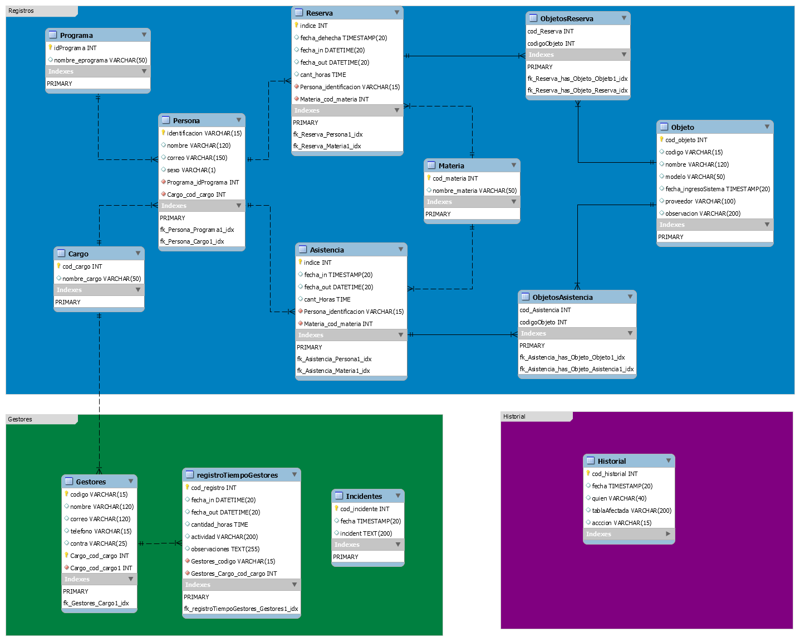

# GestorLaboratorios
Es una pagina web que permite llevar registro del uso de los laboratorios, inventario, sacar estadísticas, hacer reservas y establecer que tanto se usa.

> Mi principal labor fue desarrollar la BD

##Estructura de la BD

##Vista

